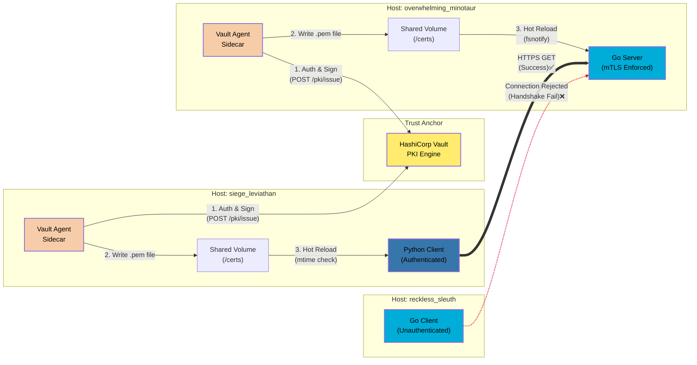

# Dynamic mTLS Microservices Sandbox

A polyglot microservices environment demonstrating "Day 2" security operations with automated, short-lived certificate rotation and a centralized Public Key Iinfrastructure (PKI).

## 🧑‍💻 Technologies
<!--technology badges here-->
<div class="technology-list" alt="This project includes the use of the following technologies:">
    
    
    
    
    
    
</div>


## 🔐 Why This Matters

Tansport Layer Security (TLS) is the backbone of the secure web. However, it is often treated as a `black box` handled by cloud providers.

This project demonsrates a **Zero Trust** architecture implemented from the ground up. By running this project you can create a locally running sandbox environment which implements and automates mutual TLS. You can experiment and debug this to your heart's content.

Instead of relying on static, long-lived, `.pem` files that are easily compromised, this system uses **HashiCorp Vault** to act as an internal Certificate Authority (CA). **Vault** automatically issues, rotates, and revokes short-lived identity certificates for these services written in different languages, proving that standardized security can be both rigorous and automated.

## 🏄‍♂️ Engineering Highlights

### 1) Dynamic Secret Injection
Certificates in this environment have a strict **24-hour** lifespans. Instead of hard coded credentials, **Vault Agents** run as sidecars to the application containers. They handle the authentication with Vault, fetch the certificates and render them to a shared volume.

### 2) Zero-Downtime Rotation
A critical challenge in mTLS is rotating certificates without killing active connections. Each service has a basic certifiation context managment mechanism.

### 3) Infrastructure as Code (IaC)
The enture Public Key Infrastructure is bootstrapped automatically via the `setup_vault.sh` script. This ensures the security environment is ephemeral and idempotent which complies with cloud-native practices.

### 4) Multiple Technology Showcase
No matter if you use Go or Python, I have tried to demonstrate basic procedures you will likely need to adopt in your project.

## 🏗️ High Level Architecture

This project simulates a high-compliance internal network where no traffic is trusted by default.



### Components

- **Hashicorp Vault** HashiCorp Vault is the PKI Engine which acts as an internal CA.
- **overwhelming-minotaur** A a secure backend server written in `Go` which enforces `mTLS`.
- **siege-levaithan** A client application using `Python` and `FastAPI` to make `TLS` authenticated requests to the `overwhelming-minotaur`.
- **reckless-sleuth** An application written in `Go` to simulate unwelcome agents. It serves as a negative test to prove that that unauthenticated traffic is rejected from `overwhelming-minotaur`.

## ⚡️ Quick Start Guide

### Prerequisites
- Docker and Docker Compose: https://www.docker.com

### Get the code
- Download this repository

### Run the System
- Open this directory in your terminal instance
- Run the following command
```bash
docker compose up --build
```

### What to Observe
- Success: `siege-leviathan` logs `overwhelming_minotaur_responds: ...`
    - Handshake success
- Rejection: `reckless-sleuth` logs `connections rejected: remote error: tls: bad certificate
    - Security boundary intact

## 📚 Documentation


## 🔮 Future Roadmap
- `OCaml` service to demonstrate non-HTTP protocols
- `Orchestration` using `Kubernetes` and `Heml`